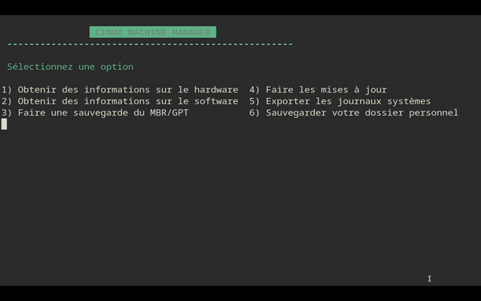

# Linux Machine Manager

#### This is a repository for shell scripts about managing a Linux Machine ####

Linux Machine Manager is a script for managing some tasks on a Linux Machine using bash, for **bash teaching purpose ONLY**
It uses many different commands to offer a wide range of knowledge to users and students. Optimizing the code to use the same commands and conventions everywhere is NOT the subject of this repository!

It display a menu which let you decide beetween this different tasks :

## Current Features

### System

- [x] Display hardware informations about the system
- [x] Display software informations about the system
- [x] Make a backup of the MBR and the GRUB configuration file
- [x] Seeing and installing updates of the Linux operating system, whatever the linux family system is
- [x] Save the system logs according to different criteria
- [x] Save the /home folder
- Restore the /home folder

